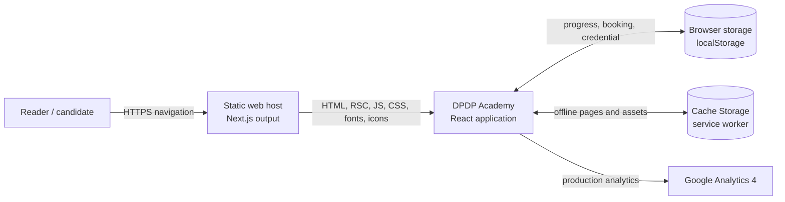
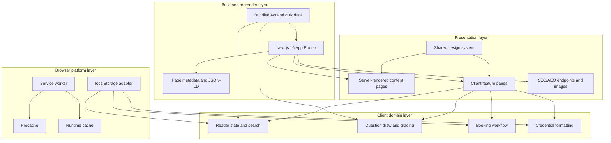
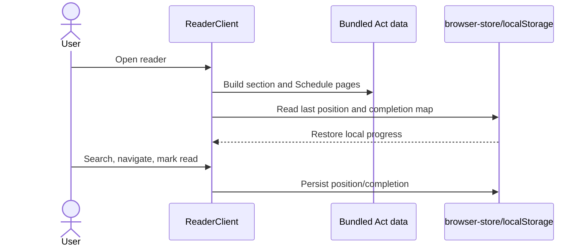
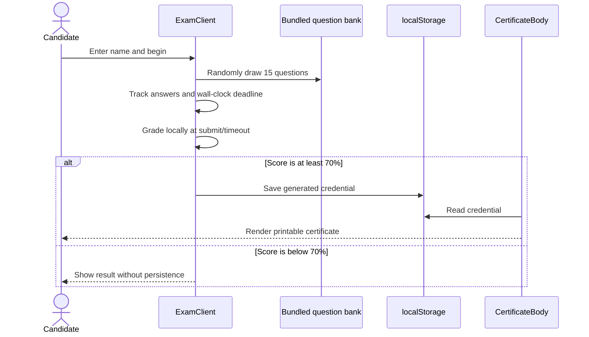
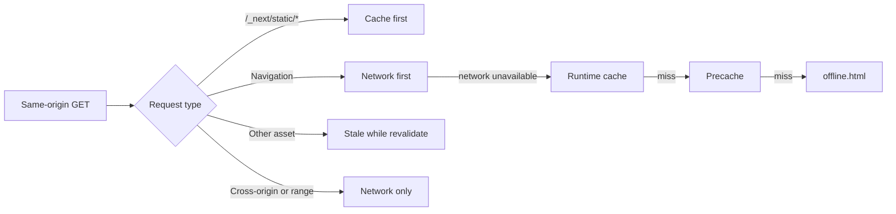
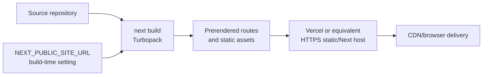

# DPDP Academy — Overall Architecture

## 1. System context

DPDP Academy is a statically rendered, browser-first educational PWA for studying the Digital Personal Data Protection Act, taking practice and certification tests, and printing a locally issued certificate.

There is intentionally no application server, database, authentication service, payment service, or credential-verification API. Certification and booking records exist only in the current browser and are therefore educational conveniences, not authoritative records.

## 2. Runtime architecture

### Build and rendering

- `src/app/` uses the Next.js App Router. Most informational routes are server components that prerender crawlable HTML.
- Interactive routes use a server `page.tsx` for metadata/structured data and a colocated client component for browser behavior.
- `src/app/layout.tsx` supplies global fonts, metadata defaults, organization/website JSON-LD, service-worker registration, and production-only GA4.
- `src/lib/site.ts` resolves the canonical origin at build time from `NEXT_PUBLIC_SITE_URL`, then Vercel's production URL, then localhost.

### Presentation and design system

- Shared site chrome lives in `src/components/site-nav.tsx` and `src/components/site-footer.tsx`.
- Reusable content components include heroes, FAQ/schema output, calls to action, certificate rendering, and the certificate seal.
- `src/components/ui/` contains the small shadcn-style component layer: buttons, inputs, badges, cards, and stat cards.
- `src/app/globals.css` is the central Tailwind v4 token and responsive/print styling layer.

### Domain and content

- `src/lib/dpdpa-data.ts` is the bundled statutory source: chapters, all 44 sections, structured text blocks, illustrations, and the penalty Schedule.
- `src/lib/dpdp-quiz.ts` is the bundled question bank plus randomized draw and assessment constants.
- `src/lib/credential.ts` defines the local credential contract and display-date formatting.
- `src/lib/routes.ts` is the shared route registry.

### Browser state

`src/lib/browser-store.ts` wraps `localStorage` with `useSyncExternalStore`, provides a safe server snapshot, broadcasts same-tab writes, and observes cross-tab storage events.

| Key | Owner | Purpose |
| --- | --- | --- |
| `dpdpa.pos` | Reader | Last open section/Schedule index |
| `dpdpa.read` | Reader | Section-level reading completion |
| `dpdp.booking` | Certification | Locally saved proctored-slot request |
| `dpdp.credential` | Exam / certificate | Most recent passing result and holder name |

Practice-test answers and live exam state remain in React memory. Reloading an active test resets it; only a passing credential is persisted.

## 3. Feature topology

| Area | Routes | Rendering and behavior |
| --- | --- | --- |
| Landing and study | `/`, `/overview`, `/roles`, `/rights`, `/obligations`, `/penalties` | Static educational pages with shared navigation/footer and selected schema markup |
| Statute reader | `/reader` | Server metadata shell plus client-side table of contents, full-text search, keyboard navigation, and stored progress |
| Certification | `/certification` | Static course/schema shell plus client-side slot booking persisted locally |
| Assessment | `/practice-test`, `/exam` | Client-side randomized questions; practice gives feedback, exam uses a wall-clock deadline and grades locally |
| Credential | `/certificate`, `/certificate/standalone` | Shared client-rendered certificate; regular route has site chrome, standalone route is optimized for print/embed |
| Discovery | `/sitemap.xml`, `/robots.txt`, `/llms.txt`, Open Graph image, manifest | Framework-generated SEO, AEO, social, and install metadata |
| Internal artifact | `/themes` | No-index visual theme reference |

## 4. Critical data flows

### Study and resume

Search is an in-memory case-insensitive scan over flattened statutory content. No query or reading activity leaves the browser except general page analytics.

### Exam to certificate

The generated credential ID is random client-side data. The printed claim cannot currently be checked against a server-side registry.

### Offline delivery

`public/sw.js` owns a versioned precache and runtime cache. Main routes, the offline page, manifest, and core icons are seeded on installation. The production-only registration component waits until page load and deliberately avoids `skipWaiting()` to reduce stale chunk failures.

## 5. Deployment architecture

- The application is naturally suited to Vercel, but any host capable of serving the Next.js build can run it.
- Canonical URLs, sitemap URLs, and Open Graph URLs require the production origin during the build.
- The service worker requires HTTPS outside localhost.
- GA4 is enabled whenever `NODE_ENV` is `production`; `NEXT_PUBLIC_GA_ID` can override its property.

## 6. Architectural qualities and boundaries

### Strengths

- Low operational complexity: content and assessment logic ship with the application.
- Offline-capable core journey with no backend dependency.
- Clear server/client split preserves metadata for interactive pages.
- Shared static data makes the reader and assessments deterministic apart from question selection.
- Browser-store abstraction handles SSR, same-tab updates, and cross-tab updates consistently.

### Current constraints

- Credentials are self-issued, editable, and unverifiable outside the originating browser.
- Bookings are not sent to a calendar or administrator.
- There is no user identity, synchronization, backup, audit history, or multi-device continuity.
- Live exam answers are not durable across reloads, and client-only grading is not tamper-resistant.
- The reader's statutory body is client-rendered on one URL, limiting section-level indexing and deep linking.
- Analytics starts in production without a consent gate.

### Natural extension boundary

If authoritative certification or real scheduling is required, add a backend boundary rather than expanding `localStorage`: authenticated users, server-side exam attempts, a credential registry with verification URLs, and a booking/calendar integration. The existing UI can continue to consume bundled public study content while those trust-sensitive workflows move behind APIs and durable storage.
