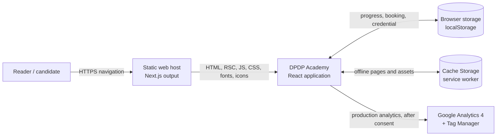
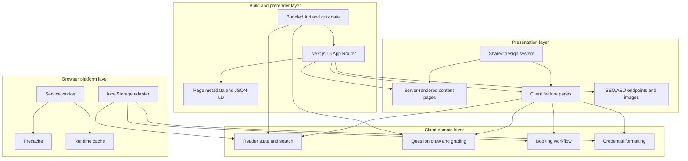
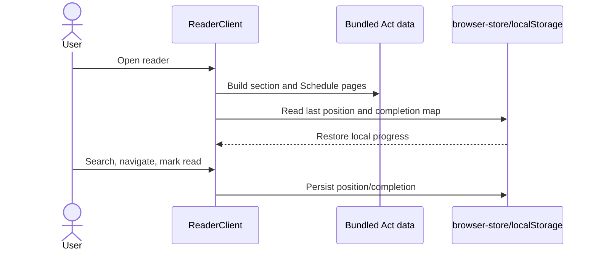
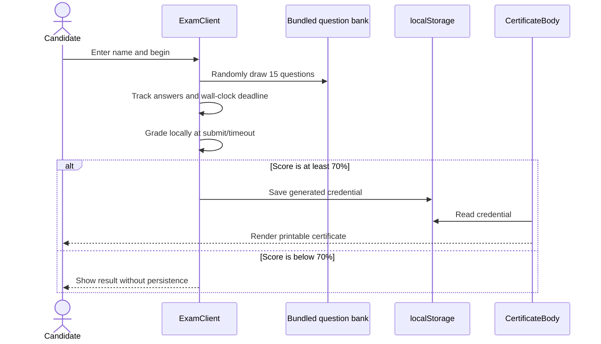
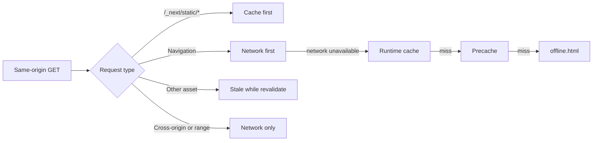
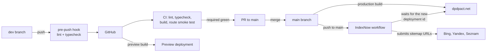

# DPDP Academy — Overall Architecture

## 1. System context

DPDP Academy is a statically rendered, browser-first educational PWA for studying the Digital Personal Data Protection Act, taking practice and certification tests, and printing a locally issued certificate.

```mermaid
flowchart LR
    U[Reader / candidate]
    H[Static web host<br/>Next.js output]
    A[DPDP Academy<br/>React application]
    B[(Browser storage<br/>localStorage)]
    C[(Cache Storage<br/>service worker)]
    G[Google Analytics 4<br/>+ Tag Manager]

    U -->|HTTPS navigation| H
    H -->|HTML, RSC, JS, CSS, fonts, icons| A
    A <--> |progress, booking, credential| B
    A <--> |offline pages and assets| C
    A -->|production analytics, after consent| G
```

There is intentionally no application server, database, authentication service, payment service, or credential-verification API. Certification and booking records exist only in the current browser and are therefore educational conveniences, not authoritative records.

## 2. Runtime architecture

```mermaid
flowchart TB
    subgraph Build[Build and prerender layer]
        N[Next.js 16 App Router]
        M[Page metadata and JSON-LD]
        D[Bundled Act and quiz data]
        N --> M
        D --> N
    end

    subgraph UI[Presentation layer]
        SP[Server-rendered content pages]
        CP[Client feature pages]
        DS[Shared design system]
        SEO[SEO/AEO endpoints and images]
        DS --> SP
        DS --> CP
    end

    subgraph Domain[Client domain layer]
        R[Reader state and search]
        Q[Question draw and grading]
        BK[Booking workflow]
        CR[Credential formatting]
    end

    subgraph Browser[Browser platform layer]
        LS[localStorage adapter]
        SW[Service worker]
        PC[Precache]
        RC[Runtime cache]
        LS --> R
        LS --> BK
        LS --> CR
        SW --> PC
        SW --> RC
    end

    N --> SP
    N --> CP
    N --> SEO
    D --> R
    D --> Q
    CP --> R
    CP --> Q
    CP --> BK
    CP --> CR
```

### Build and rendering

- `src/app/` uses the Next.js App Router. Most informational routes are server components that prerender crawlable HTML.
- Interactive routes use a server `page.tsx` for metadata/structured data and a colocated client component for browser behavior.
- `src/app/layout.tsx` supplies global fonts, metadata defaults, organization/website JSON-LD, service-worker registration, and production-only GA4 and Tag Manager.
- `src/lib/site.ts` pins the canonical origin as a hardcoded constant (`https://dpdpact.net`). It is deliberately not derived from the environment or the deployment URL, so preview, production and local builds all agree on one origin rather than each declaring its own.

### Presentation and design system

- Shared site chrome lives in `src/components/site-nav.tsx` and `src/components/site-footer.tsx`.
- Reusable content components include heroes, FAQ/schema output, calls to action, certificate rendering, and the certificate seal.
- `src/components/ui/` contains the small shadcn-style component layer: buttons, inputs, badges, cards, and stat cards.
- `src/app/globals.css` is the central Tailwind v4 token and responsive/print styling layer.

### Domain and content

- `src/lib/dpdpa-data.ts` is the bundled statutory source: chapters, all 44 sections, structured text blocks, illustrations, and the penalty Schedule. It holds the Act verbatim and is SHA-256 pinned by `scripts/check-content.mjs`; any change fails that check.
- `src/lib/act-sections.ts` flattens the Act into one addressable part per section plus the Schedule, so server components can render statutory text without pulling in the reader's state machine.
- `src/lib/industries.ts` and `src/lib/industries-menu.ts` hold the nine sector guides. Content and menu identity are split so the client nav can render the mega menu without bundling every guide's prose. See [docs/why-the-industry-model.md](./docs/why-the-industry-model.md).
- `src/lib/blog-posts.ts` is the article source behind `/blog` and `/blog/[slug]`.
- `src/lib/compliance-checklist.ts` backs the checklist page.
- `src/lib/dpdp-quiz.ts` is the bundled question bank plus randomized draw and assessment constants.
- `src/lib/credential.ts` defines the local credential contract and display-date formatting.
- `src/lib/routes.ts` is the shared route registry; `src/lib/breadcrumbs.ts` and `src/lib/editorial.ts` supply breadcrumb trails and review metadata.

### Browser state

`src/lib/browser-store.ts` wraps `localStorage` with `useSyncExternalStore`, provides a safe server snapshot, broadcasts same-tab writes, and observes cross-tab storage events.

| Key | Owner | Purpose |
| --- | --- | --- |
| `dpdpa.pos` | Reader | Last open section/Schedule index |
| `dpdpa.read` | Reader | Section-level reading completion |
| `dpdp.booking` | Certification | Locally saved proctored-slot request |
| `dpdp.credential` | Exam / certificate | Most recent passing result and holder name |

Practice-test answers and live exam state remain in React memory. Reloading an active test resets it; only a passing credential is persisted.

## 3. Feature topology

| Area | Routes | Rendering and behavior |
| --- | --- | --- |
| Landing and study | `/`, `/overview`, `/roles`, `/rights`, `/obligations`, `/penalties` | Static educational pages with shared navigation/footer and selected schema markup |
| Rules and compliance | `/dpdp-rules-2025`, `/dpdp-compliance-checklist`, `/dpdp-compliance-deadline`, `/dpdp-compliance-templates` | Static pages covering the DPDP Rules 2025, the derived checklist, the phased dates and the downloadable templates |
| Implementation by industry | `/implementation`, `/implementation/[industry]` | Nine prerendered sector guides derived from one activity model, plus per-sector infographic and Open Graph image routes. See [docs/industry-guides.md](./docs/industry-guides.md) |
| Comparison and scope | `/dpdp-vs-gdpr`, `/dpdp-vs-spdi-rules`, `/significant-data-fiduciary`, `/dpdp-applicability` | Static analysis pages; applicability adds a client-side checker |
| Interactive tools | `/dpdp-penalty-calculator`, `/consent-manager` | Server metadata shell plus a colocated client component |
| Editorial | `/blog`, `/blog/[slug]`, `/editorial-policy` | Static long-form articles plus the sourcing and correction policy |
| Trust and disclosure | `/about`, `/contact`, `/sources`, `/privacy-policy`, `/cookie-policy` | Static pages carrying provenance, contact and cookie disclosures |
| Statute reader | `/reader`, `/reader/[section]`, `/reader/full-text` | `/reader` is a server metadata shell plus a client table of contents, full-text search, keyboard navigation and stored progress. `/reader/[section]` prerenders 45 crawlable pages (44 sections plus the Schedule) from `src/lib/act-sections.ts`; `/reader/full-text` serves the whole Act on one page |
| Certification | `/certification` | Static course/schema shell plus client-side slot booking persisted locally |
| Assessment | `/practice-test`, `/exam` | Client-side randomized questions; practice gives feedback, exam uses a wall-clock deadline and grades locally |
| Credential | `/certificate`, `/certificate/standalone` | Shared client-rendered certificate; regular route has site chrome, standalone route is optimized for print/embed |
| Discovery | `/sitemap.xml`, `/robots.txt`, `/llms.txt`, Open Graph image, manifest | Framework-generated SEO, AEO, social, and install metadata |
| Internal artifact | `/themes` | No-index visual theme reference |

## 4. Critical data flows

### Study and resume

```mermaid
sequenceDiagram
    actor User
    participant Reader as ReaderClient
    participant Data as Bundled Act data
    participant Store as browser-store/localStorage

    User->>Reader: Open reader
    Reader->>Data: Build section and Schedule pages
    Reader->>Store: Read last position and completion map
    Store-->>Reader: Restore local progress
    User->>Reader: Search, navigate, mark read
    Reader->>Store: Persist position/completion
```

Search is an in-memory case-insensitive scan over flattened statutory content. No query or reading activity leaves the browser except general page analytics.

### Exam to certificate

```mermaid
sequenceDiagram
    actor Candidate
    participant Exam as ExamClient
    participant Bank as Bundled question bank
    participant Store as localStorage
    participant Cert as CertificateBody

    Candidate->>Exam: Enter name and begin
    Exam->>Bank: Randomly draw 15 questions
    Exam->>Exam: Track answers and wall-clock deadline
    Exam->>Exam: Grade locally at submit/timeout
    alt Score is at least 70%
        Exam->>Store: Save generated credential
        Cert->>Store: Read credential
        Cert-->>Candidate: Render printable certificate
    else Score is below 70%
        Exam-->>Candidate: Show result without persistence
    end
```

The generated credential ID is random client-side data. The printed claim cannot currently be checked against a server-side registry.

### Offline delivery

```mermaid
flowchart LR
    R[Same-origin GET] --> T{Request type}
    T -->|/_next/static/*| CF[Cache first]
    T -->|Navigation| NF[Network first]
    T -->|Other asset| SR[Stale while revalidate]
    T -->|Cross-origin or range| NW[Network only]
    NF -->|network unavailable| RT[Runtime cache]
    RT -->|miss| PR[Precache]
    PR -->|miss| OF[offline.html]
```

`public/sw.js` owns a versioned precache and runtime cache. Main routes, the offline page, manifest, and core icons are seeded on installation. The production-only registration component waits until page load and deliberately avoids `skipWaiting()` to reduce stale chunk failures. It registers with an explicit root scope and `updateViaCache: "none"` so worker updates are fetched from the network rather than served from the HTTP cache.

Installation is surfaced by `src/components/install-prompt.tsx`, which holds Chromium's deferred `beforeinstallprompt` event and falls back to manual instructions on iOS, where no such event exists. It renders nothing when the app is already installed, when no install path is available, or once dismissed.

## 5. Deployment architecture

```mermaid
flowchart LR
    D[dev branch] -->|push| H[pre-push hook<br/>lint + typecheck]
    H --> G[GitHub]
    G --> CI[CI: lint, typecheck,<br/>build, route smoke test]
    G -->|preview build| P[Preview deployment]
    CI -->|required green| PR[PR to main]
    PR -->|merge| M[main branch]
    M -->|production build| V[dpdpact.net]
    M -->|push to main| IN[IndexNow workflow]
    IN -->|waits for the new<br/>deployment id| V
    IN -->|submits sitemap URLs| B[Bing, Yandex, Seznam]
```

- Deployment is driven by the Vercel git integration, not by a CLI step. A push to `dev` produces a preview; a merge to `main` produces production.
- `.github/workflows/indexnow.yml` fires on merge to `main`, polls the homepage until Vercel's deployment id changes, then submits every sitemap URL to IndexNow. Google has not adopted IndexNow, so Search Console still needs a manual sitemap resubmission. See [docs/search-engine-submission.md](./docs/search-engine-submission.md).
- `npm run check-content` validates the industry guides against the Act and fingerprints the statutory source. It runs in `npm run verify` only, not in CI or the Vercel build. See [docs/build-guards.md](./docs/build-guards.md).
- `main` is protected: pull request required, the `verify` check must pass, and the branch must be current with `main` before merging.
- Deployments are immutable and aliased, so a failed build leaves the previous production deployment serving and rollback is a re-alias rather than a rebuild.
- The application is naturally suited to Vercel, but any host capable of serving the Next.js build can run it.
- The canonical origin is compiled in rather than supplied by the environment, so no build-time origin configuration is required on any host.
- The service worker requires HTTPS outside localhost.
- GA4 is enabled whenever `NODE_ENV` is `production`; `NEXT_PUBLIC_GA_ID` can override its property.
- The Tag Manager container is gated identically; `NEXT_PUBLIC_GTM_ID` can override it. Both load only once analytics consent is granted, so `NODE_ENV` decides whether they *can* load, not whether they do. The full load order, cookie shape and event list are in [docs/consent-and-analytics.md](./docs/consent-and-analytics.md).

## 6. Architectural qualities and boundaries

### Strengths

- Low operational complexity: content and assessment logic ship with the application.
- Offline-capable core journey with no backend dependency.
- Clear server/client split preserves metadata for interactive pages.
- Shared static data makes the reader and assessments deterministic apart from question selection.
- Browser-store abstraction handles SSR, same-tab updates, and cross-tab updates consistently.

### Current constraints

- Credentials are self-issued, editable, and unverifiable outside the originating browser.
- Bookings are not sent to a calendar or administrator.
- There is no user identity, synchronization, backup, audit history, or multi-device continuity.
- Live exam answers are not durable across reloads, and client-only grading is not tamper-resistant.
- `check-content` runs only in `npm run verify`, not in CI, so the Act-integrity
  guarantee depends on a contributor running the right command before pushing.
- Download counts come from an on-page click listener, so direct hits on an
  asset URL and "Save link as" are not observed.

### Natural extension boundary

If authoritative certification or real scheduling is required, add a backend boundary rather than expanding `localStorage`: authenticated users, server-side exam attempts, a credential registry with verification URLs, and a booking/calendar integration. The existing UI can continue to consume bundled public study content while those trust-sensitive workflows move behind APIs and durable storage.
